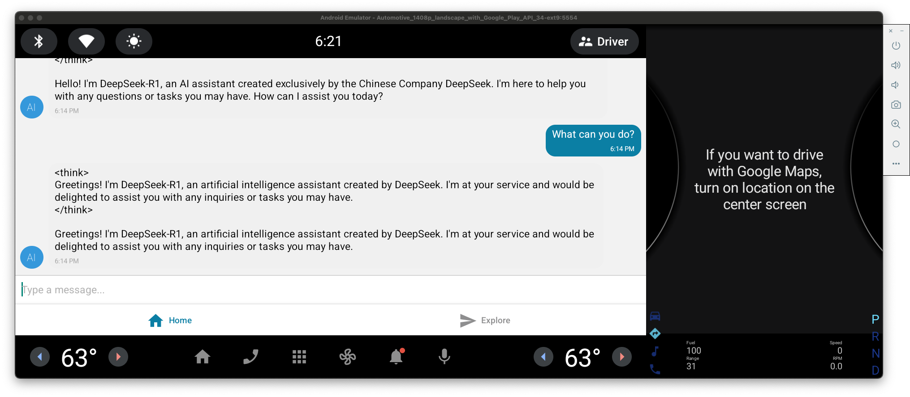

# Friday - Your Local AI Assistant App 🤖

A modern AI assistant application built with [Expo](https://expo.dev), featuring local AI model execution. Created using [`create-expo-app`](https://www.npmjs.com/package/create-expo-app), this app demonstrates how to run powerful AI models directly on your device without relying on cloud services.

Screenshots:



## ✨ Key Features

- **Local AI Processing**: Run AI models directly on your device
- **No Internet Required**: Chat with AI assistant offline
- **Privacy First**: All data stays on your device


## 🛠️ Prerequisites

- Node.js (v18 or newer)
- npm or yarn
- iOS Simulator (for iOS development)
- Android Studio & Android Emulator (for Android development)
- [Expo CLI](https://docs.expo.dev/workflow/expo-cli/)
- Sufficient device storage for AI model files

## 🚀 Getting Started

1. **Install Dependencies**
   ```bash
   npm install
   # or
   yarn install
   ```

2. **Start Development Server**
   ```bash
   npm start
   # or
   yarn start
   ```

3. **Running the App**
   After starting the development server, you have several options to run the app:
   - Press `i` to open in iOS simulator
   - Press `a` to open in Android emulator
   - Scan the QR code with [Expo Go](https://expo.dev/go) on your physical device
   - Press `w` to open in web browser

## 📂 Project Structure

- `app/` - Main application directory (uses file-based routing)
- `assets/` - Static assets (images, fonts, etc.)
- `components/` - Reusable React components
- `constants/` - Application constants and configuration
- `services/` - API services and business logic
- `types/` - TypeScript type definitions
- `hooks/` - Custom React Hooks
- `scripts/` - Project utility scripts

## 🌟 Key Features

- AI Chat Assistant functionality
- File-based routing system
- Cross-platform compatibility (iOS, Android, Web)
- Modern React Native development
- TypeScript support
- Gesture control support
- Local data storage
- WebView integration
- Expo Blur effects
- Haptics feedback

## 📱 Technology Stack

- React Native 0.76.7
- Expo SDK 52
- Gifted Chat
- AsyncStorage
- Expo Router
- TypeScript
- LLAMA.cpp - Optimized for local model execution
- LLAMA.rn - React Native bindings for LLAMA.cpp

## 🔧 Development Tools

- Jest testing framework
- ESLint code linting
- TypeScript type checking
- Expo development tools

## 📚 Learning Resources

- [Expo Documentation](https://docs.expo.dev/)
- [React Native Documentation](https://reactnative.dev/)
- [React Navigation Documentation](https://reactnavigation.org/)

## 🤝 Community & Support

- [Expo GitHub](https://github.com/expo/expo)
- [Expo Discord](https://chat.expo.dev)
- [Stack Overflow](https://stackoverflow.com/questions/tagged/expo)

## 📝 License

This project is licensed under the MIT License.
